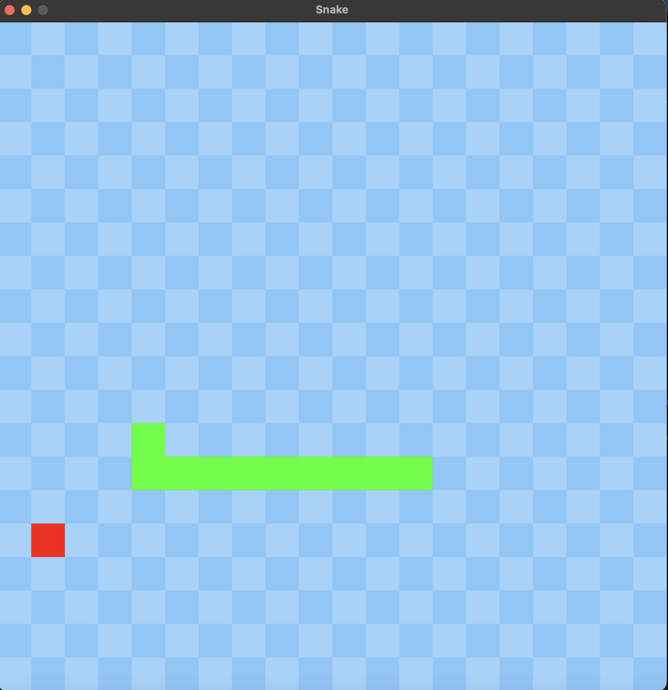

A basic snake game written in Python with pygame. This game was NOT vibecoded.

<p align="center">
  
</p>

## How to play

```bash
python -m venv .venv
source .venv/bin/activate   # Windows: .venv\Scripts\activate
pip install -r requirements.txt
python game.py
```

Controls: **W / A / S / D** to move. Eat the red fruit, avoid the walls and yourself.

## To do

- [ ] Start screen
- [ ] Counter
- [ ] Win screen
- [ ] Settings
